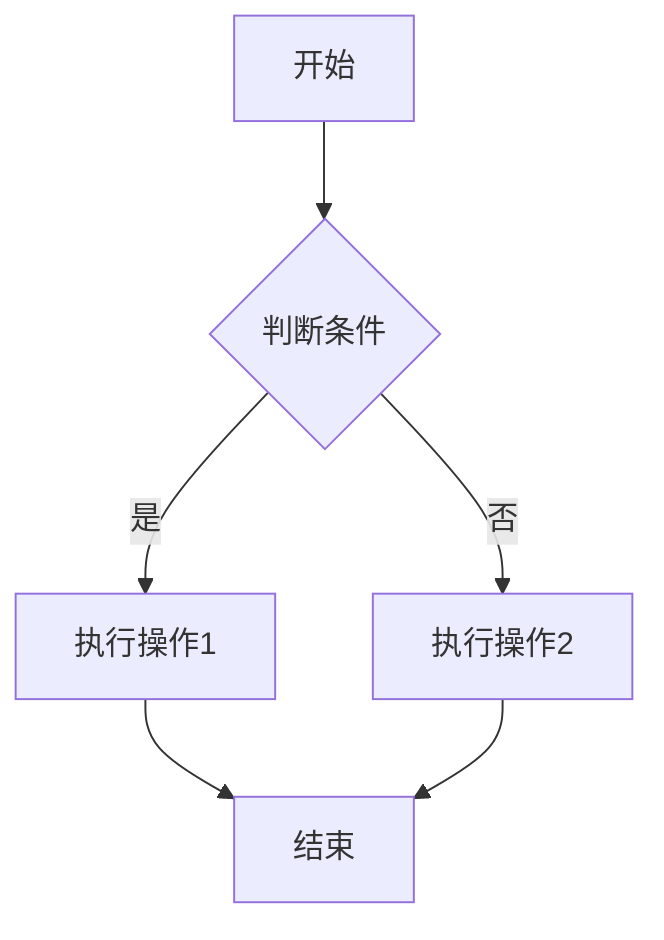
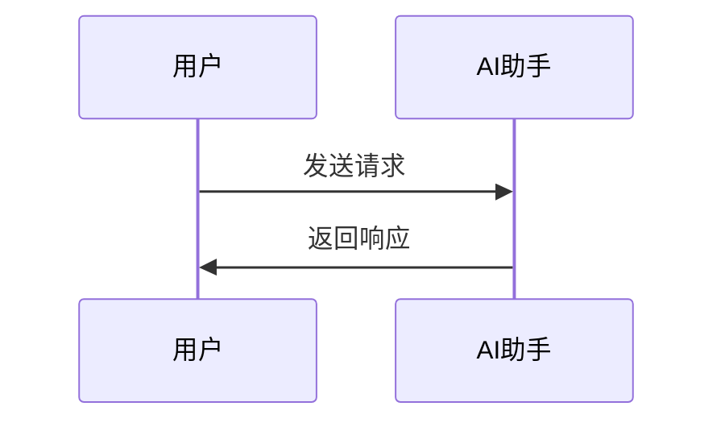
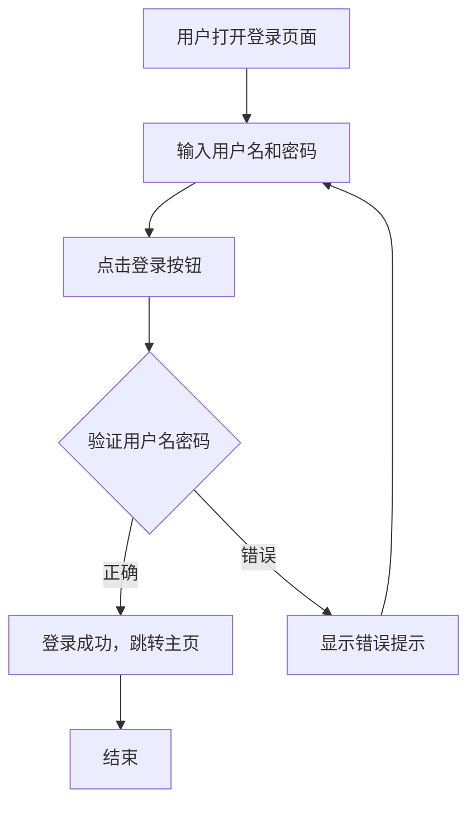

# Claude Code 工作空间配置

## 图表生成规则

当用户要求生成以下类型的图表时，**必须使用 Mermaid 语法**：

- 流程图 (Flowchart)
- 时序图 (Sequence Diagram)
- 类图 (Class Diagram)
- 状态图 (State Diagram)
- 甘特图 (Gantt Chart)
- 饼图 (Pie Chart)
- ER图 (ER Diagram)
- 用户旅程图 (User Journey)

## Mermaid 语法示例

### 流程图


### 时序图


## 输出格式要求

1. **始终使用 ```mermaid 代码块**包裹图表代码
2. 不要使用其他图表语法（如 PlantUML、Graphviz 等）
3. 图表代码应该清晰易读，适当添加注释
4. 中文标签优先，除非用户指定使用英文

## 示例响应

当用户说"画一个登录流程图"时，应该这样响应：

````
这是一个登录流程图：



你可以根据需要调整流程步骤。
````
